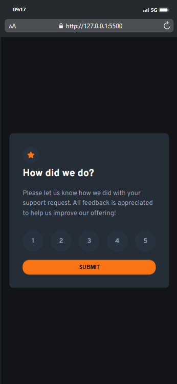
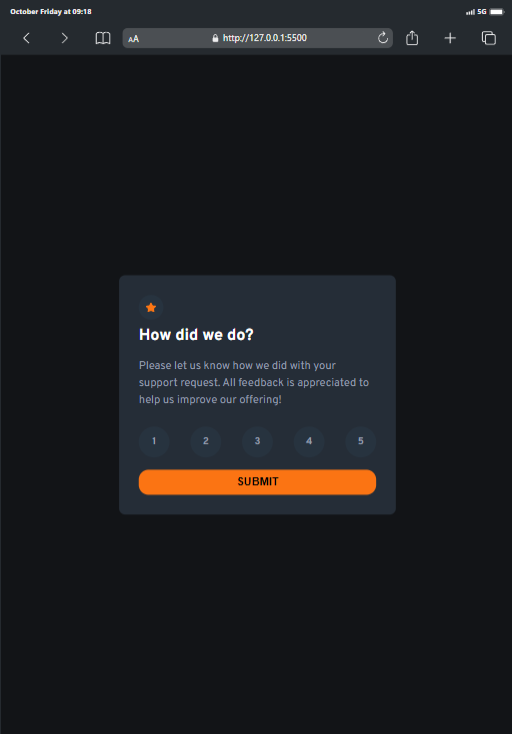
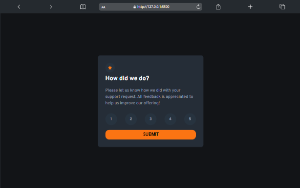

# Frontend Mentor - Interactive rating component solution

This is a solution to the  
[Interactive rating component challenge on Frontend Mentor](https://www.frontendmentor.io/challenges/interactive-rating-component-koxpeBUmI).
Frontend Mentor challenges help you improve your coding skills by building
realistic projects.

## Table of contents

- [Overview](#overview)
  - [The challenge](#the-challenge)
  - [Screenshot](#screenshot)
  - [Links](#links)
- [My process](#my-process)
  - [Built with](#built-with)
  - [What I learned](#what-i-learned)
  - [Continued development](#continued-development)
  - [Useful resources](#useful-resources)
- [Author](#author)
- [Acknowledgments](#acknowledgments)

## Overview

### The challenge

Users should be able to:

- View the optimal layout for the app depending on their device's screen size
- See hover states for all interactive elements on the page
- Select and submit a number rating
- See the "Thank you" card state after submitting a rating

### Screenshot





### Links

Here’s a screenshot of my solution showcasing the rating component with
responsive design and accessible UI.

- Solution URL:
  [Interactive Rating Component](https://github.com/Mubarak-Adeyemi/interactive-rating-component-main)
- Live Site URL:
  [Interactive Rating Component](https://mubarak-adeyemi.github.io/interactive-rating-component-main/)

## My process

### Built with

- Semantic HTML5 markup
- CSS custom properties (variables)
- Flexbox for layout and alignment
- Mobile-first workflow
- Vanilla JavaScript for interactivity
- Accessibility features using aria attributes

### What I learned

This project allowed me to deepen my understanding of building accessible and
user-friendly components. Here are some key things I learned:

#### ARIA attributes for accessibility:

I learned to better utilize aria-label, aria-labelledby, and role to ensure
screen readers can understand the form structure and error handling.

```html
<form id="rating-component" aria-describedby="error-message">
  <div
    class="rating-buttons"
    role="radiogroup"
    aria-label="Rating options from 1 to 5"
  >
    <input
      type="radio"
      name="rating"
      id="rating-1"
      value="1"
      aria-label="1 out of 5"
    />
    <label for="rating-1">1</label>
    ...
  </div>
</form>
```

#### Smooth CSS transitions:

I improved my skills in creating fluid animations using transition for button
and label interactions.

```css
.rating-buttons label:hover {
  background-color: var(--Orange);
  transform: scale(1.2);
}
```

#### Dynamic form handling with vanilla JS:

I practiced handling form submissions, managing the display of modal dialogs,
and resetting form elements after submission.

```js
ratingForm.addEventListener("submit", function (e) {
  e.preventDefault();

  const selected = document.querySelector("input[name='rating']:checked");
  if (selected) {
    selectedRating.textContent = selected.value;
    thankYouModal.showModal();
    errorMessage.classList.remove("show");
    ratingForm.reset();
  } else {
    errorMessage.classList.add("show");
  }
});
```

### Continued development

I want to continue refining my skills in the following areas:

- Accessibility improvements: Further refining accessibility to meet WCAG
  standards by ensuring proper focus management and keyboard navigation.

- Advanced animations: Experimenting with more advanced CSS animations and
  keyframes for a more interactive user experience.

### Useful resources

- [MDN Web Docs](https://developer.mozilla.org/en-US/docs/Web/Accessibility/ARIA/Roles) -
  Aria roles and properties - This helped me better understand the correct usage
  of ARIA roles and properties.

## Author

- Frontend Mentor -
  [Mubarak-Adeyemi](https://www.frontendmentor.io/profile/Mubarak-Adeyemi)
- Twitter - [@mubarakElarabiy](https://www.twitter.com/@mubarakElarabiy)

## Acknowledgments

I would like to thank the Frontend Mentor community for their ongoing support
and feedback on this project. Special thanks to those who gave suggestions for
accessibility improvements and UI optimizations.
